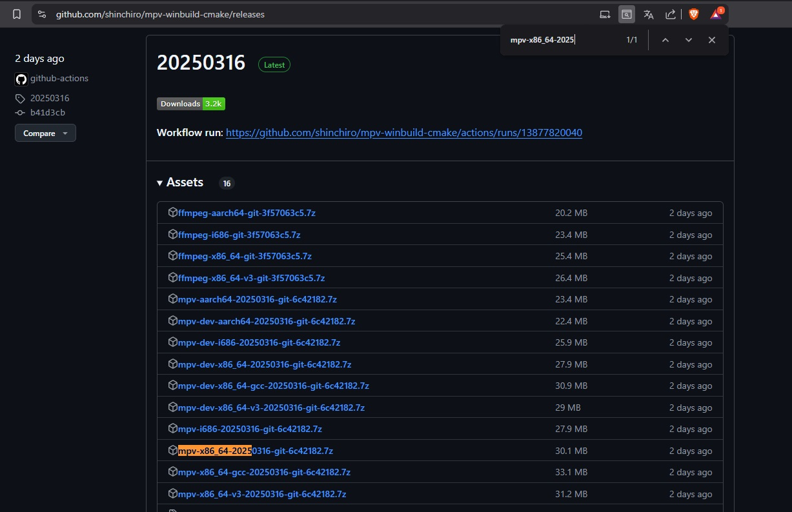
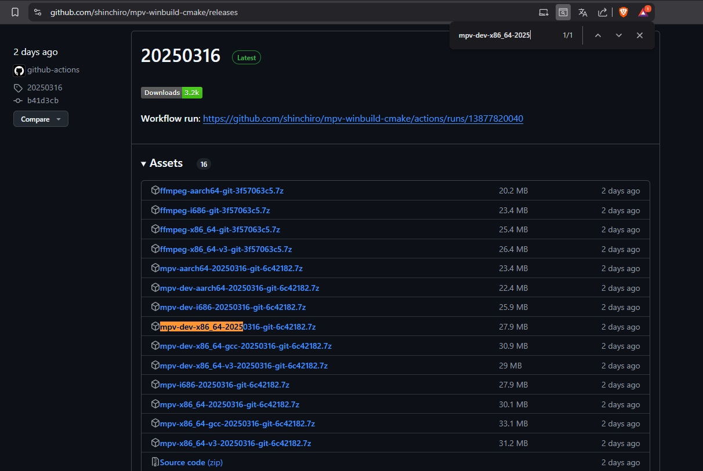
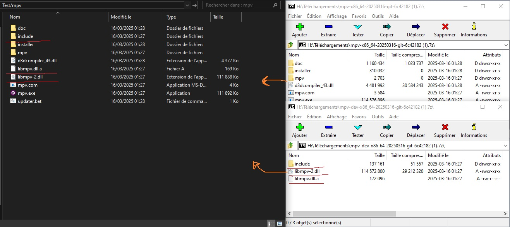
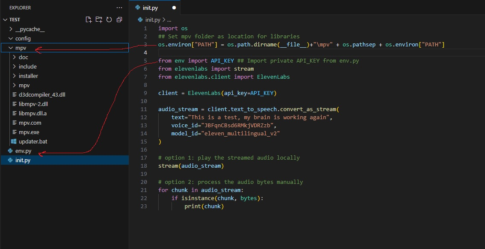

### Installation process
1. as shown in the official https://mpv.io/installation/ website, head to the first repository https://github.com/shinchiro/mpv-winbuild-cmake/releases
<br><hr><br>
2. Click to expand the "See all 16 assets" and grab "mpv-x86_64-2025**.7z" and "mpv-dev-x86_64-2025***.7z" zip files, the first one contains the program, the second the DLL libraries<br><br>
<br><hr><br>
3. In you project root folder, create an mpv folder, and dump both the program and the DLL files<br>
<br><hr><br>
4. Set your python script to look for the DLLs in you newly created "mpv" folder"
```python
import os
## Set mpv folder as location for libraries
os.environ["PATH"] = os.path.dirname(__file__)+"\mpv" + os.pathsep + os.environ["PATH"]

from env import API_KEY ## Import private API_KEY from env.py
from elevenlabs import stream
from elevenlabs.client import ElevenLabs

client = ElevenLabs(api_key=API_KEY)

audio_stream = client.text_to_speech.convert_as_stream(
    text="This is a test, my brain is working again",
    voice_id="JBFqnCBsd6RMkjVDRZzb",
    model_id="eleven_multilingual_v2"
)

# option 1: play the streamed audio locally
stream(audio_stream)

# option 2: process the audio bytes manually
for chunk in audio_stream:
    if isinstance(chunk, bytes):
        print(chunk)
```
<br><hr><br>
Your project should look like this: 
